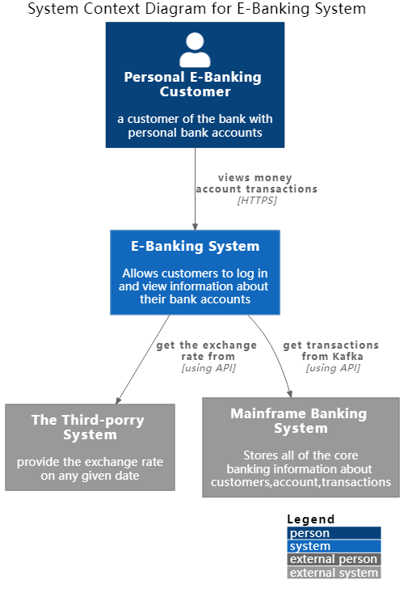
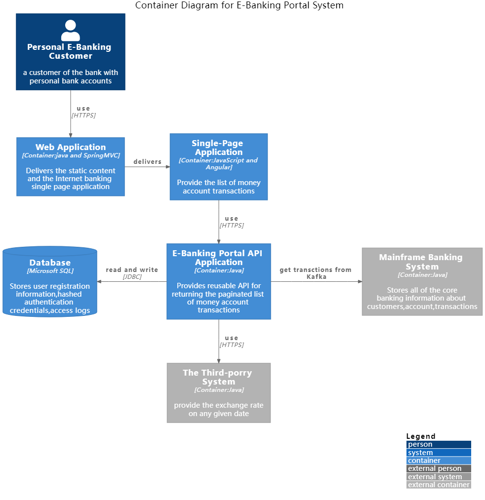
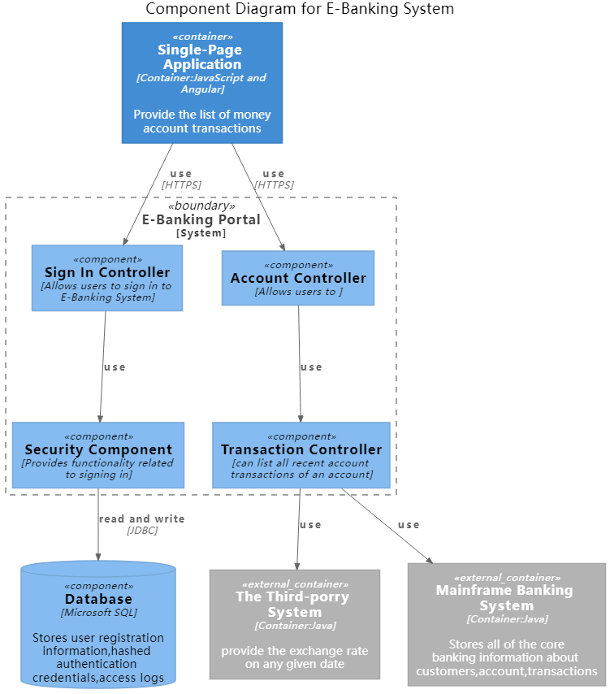

# e-Banking-Protal
For an e-Banking Portal you have been given the task to design and implement a reusable REST API for returning the paginated list of money account transactions created in an arbitrary calendar month for a given customer who is logged-on in the portal. For each transaction 'page' return the total credit and debit values at the current exchange rate (from the third-porry provider). The list of transactions should be consumed from a Kafka topic. Build a Docker image out of the application and prepare the configuration for deploying it to Kubernetes / OpenShift.

Assumptions:

- Every e-bonking client has one or more accounts in dfferent currencies (e.g. GBP, EUR, CHF)
- There are approximately one hundred thousand e-banking customers, each with a couple thousands of transactions per month.
- The transactions cover the last ten years and are stored in Kafka with the key being the transaction ID and the value the JSON representation of the transaction
- The user is alreody authenticated and the API client invoking the transaction API will send a JWT token containing the user's unique identity key (e.g. P-0123456789)
- The exchange rate on any given dote its provided by an external API

For simplicity reasons, consider a money account transaction composed of the following attnbutes:
- Unique identifier (e.g. 89d3o179-blbc-465b-o9ee-e2d5f6ofEld46)
- Amount with currency (eg GBP 100-, CHF 75)
- Account IBAN (eg. CH93-0000-0000-0000-0000-0)
- Value dote (e.g. 01-10-2020)
- Descriptioin (e.g. Online payment CHF)
##C4 Model
### Context
coustomer can use E-Banking System to log in and view information about their bank acoounts.
And the E-Banking System need to get the exchange rate from the Third-porry System and get account information from Mainframe Banking System.

### Container

### Component
