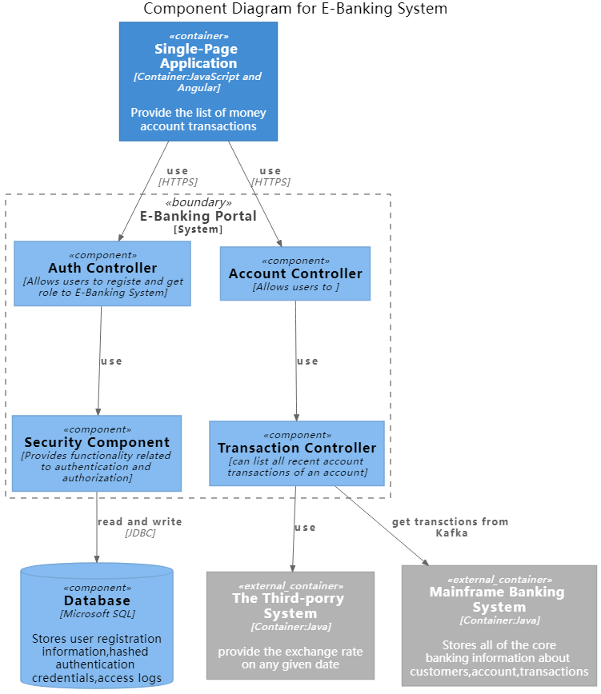
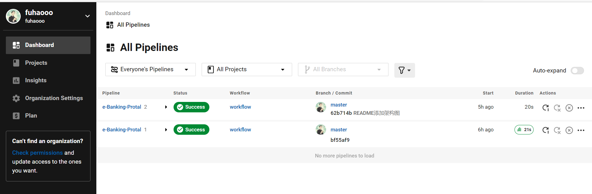

# e-Banking-Protal
For an e-Banking Portal you have been given the task to design and implement a reusable REST API for returning the paginated list of money account transactions created in an arbitrary calendar month for a given customer who is logged-on in the portal. For each transaction 'page' return the total credit and debit values at the current exchange rate (from the third-porry provider). The list of transactions should be consumed from a Kafka topic. Build a Docker image out of the application and prepare the configuration for deploying it to Kubernetes / OpenShift.

Assumptions:

- Every e-bonking client has one or more accounts in dfferent currencies (e.g. GBP, EUR, CHF)
- There are approximately one hundred thousand e-banking customers, each with a couple thousands of transactions per month.
- The transactions cover the last ten years and are stored in Kafka with the key being the transaction ID and the value the JSON representation of the transaction
- The user is alreody authenticated and the API client invoking the transaction API will send a JWT token containing the user's unique identity key (e.g. P-0123456789)
- The exchange rate on any given dote its provided by an external API

For simplicity reasons, consider a money account transaction composed of the following attnbutes:
- Unique identifier (e.g. 89d3o179-blbc-465b-o9ee-e2d5f6ofEld46)
- Amount with currency (eg GBP 100-, CHF 75)
- Account IBAN (eg. CH93-0000-0000-0000-0000-0)
- Value dote (e.g. 01-10-2020)
- Descriptioin (e.g. Online payment CHF)
##C4 Model
### Context
coustomer can use E-Banking System to log in and view information about their bank acoounts.
And the E-Banking System need to get the exchange rate from the Third-porry System and get account information from Mainframe Banking System.


### Container

### Component


## 表结构设计
```SQL
CREATE TABLE `e_banking_user` (
  `user_id` int NOT NULL COMMENT '主键ID',
  `username` varchar NOT NULL COMMENT '用户名',
  `password` varchar NOT NULL COMMENT '密码',
  `role` varchar NOT NULL COMMENT '角色',
  `gmt_create` timestamp NOT NULL DEFAULT CURRENT_TIMESTAMP COMMENT '加入时间',
  `gmt_modify` timestamp NOT NULL DEFAULT CURRENT_TIMESTAMP ON UPDATE CURRENT_TIMESTAMP COMMENT '更新时间',
  PRIMARY KEY (`user_id`),
) ENGINE=InnoDB DEFAULT CHARSET=utf8 COMMENT='用户信息表';

CREATE TABLE `account` (
  `account_uuid` varchar NOT NULL COMMENT '主键ID',
  `accountId` varchar NOT NULL COMMENT '银行账户ID',
  `misidn` bigint NOT NULL COMMENT '电话号码',
  `credit_balance` int NOT NULL DEFAULT '0' COMMENT '贷方余额',
  `debit_balance` int NOT NULL DEFAULT '0' COMMENT '借方余额',
  `currency` varchar NOT NULL COMMENT '货币种类',
  `gmt_create` timestamp NOT NULL DEFAULT CURRENT_TIMESTAMP COMMENT '加入时间',
  `gmt_modify` timestamp NOT NULL DEFAULT CURRENT_TIMESTAMP ON UPDATE CURRENT_TIMESTAMP COMMENT '更新时间',
  PRIMARY KEY (`account_uuid`),
  KEY `idx_misidn_id` (`accountId`,`misidn`) USING BTREE COMMENT '银行账户ID,电话号码联合索引'
) ENGINE=InnoDB DEFAULT CHARSET=utf8 COMMENT='账户表';
```


## CI/CD策略
### Pipeline设计

CI技术选型：CircleCI作为云服务，对开源项目免费，不需要再搭建CI系统，并且跟GitHub集成的较为紧密，其次circleCI在国外，推送镜像到DockerHub速度会比较快。Jenkins在本地部署的情况下，没有公网IP，代码的变更会通知不到，本地推送镜像会比较慢。

CD技术选型：ArgoCD，面向K8s，支持GitOps的开源CD平台，可以追溯到历史的变更以及回滚，发布策略，更符合云原生交付理念。

使用CircleCI实现自动集成功能
